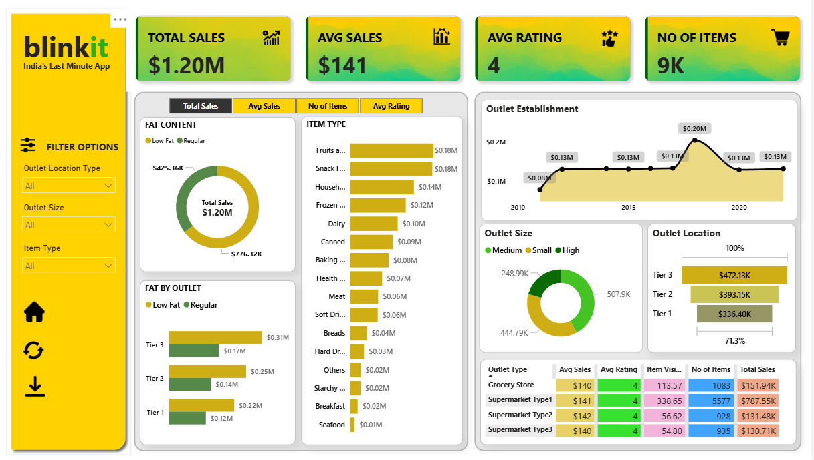

# 📊 Blinkit Dashboard - Power BI

This repository contains a Power BI dashboard designed for **Blinkit**, showcasing key business metrics and visual insights for sales performance, item types, outlet analysis, and more.

## 🔍 Overview

The **Blinkit Dashboard** is built to analyze and visualize critical business data, helping stakeholders make informed decisions quickly. It provides insights into:

- ✅ Total Sales & Average Sales  
- ⭐ Average Customer Ratings  
- 📦 Item Type Sales Distribution  
- 🏬 Outlet Performance (Location, Size, Tier)  
- 🧈 Fat Content Analysis  
- 🕒 Sales Trends over Time  

## 🛠 Built With

- **Power BI Desktop**
- Data modeling with relationships and calculated fields
- Interactive slicers for filtering by:
  - Outlet Location Type
  - Outlet Size
  - Item Type

## 📌 Key Features

- Responsive and interactive visualizations
- Dynamic filters/slicers to explore data across various dimensions
- Pie charts, bar charts, line charts, and tables for detailed analysis
- Clean and modern UI inspired by Blinkit branding
- 🏠 **Home Button** for easy navigation
- 🔄 **Refresh Button** to clear slicer filters and reset view
- ⬇️ **Download Button** to export or save relevant visuals/data

## 🖼 Dashboard Visuals

- **Total Sales:** $1.20M overall sales  
- **Top Performing Tiers:** Tier 3 outlets with highest revenue  
- **Item Categories:** Fruits, Snacks, and Household items lead sales  
- **Time Trends:** Sales performance from 2010 to 2022  
- **Outlet Analysis:** Based on fat content, location, and size  

## 📁 Files Included

- `BlinkitDashboard_Image.png`: Preview image of the dashboard
- (Add your `.pbix` file here if you want to share the Power BI file)

## 🚀 Getting Started

1. Download and install [Power BI Desktop](https://powerbi.microsoft.com/desktop/)
2. Clone this repository
3. Open the `.pbix` file in Power BI Desktop (if provided)
4. Explore and interact with the visualizations

## 📄 License

This project is open-source and available under the [MIT License](LICENSE).

## 🙋‍♂️ Acknowledgments

- Inspired by Blinkit’s branding and data-driven decision making
- Created as a personal learning project for Power BI dashboarding
